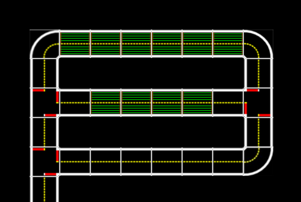

# Auto-charging {#aido-auto-charging}

Duckiebots with a built-in 10400mAh battery are capable of driving for roughly 7 hours. Therefore to create a fully autonomous Duckietown, a charging station is a crucial part. This chapter describes how to setup and operate a charging area. It is highly recommended to have a 3D-printer available in order to tune the flexibility of some parts - if this is not the case, URLs for ordering the parts are provided.

## Definitions

### Current collector

The current collector is a flexible shaft mounted on top of a Duckiebot. Its purpose is to make contact with the charging rails.

### Charging rail

A charging rail is a brass tube mounted over a Duckietown with the help of a wooden structure.

### Wooden structure

The purpose of the wooden structure is to mount the charging rails over the street.

### Charging rail tiles

Charging rail tiles are tiles with charging rails. Duckiebots can charge in both directions. Each charging rail tile has $8$ brass rails.

### Insulator

The insulator connects the wooden structure with the charging rails.

### Charging module

A charging module describes the combination of a charging rail and all connected straights and curves up to the next intersection.

### Charger

A charger describes one single lane of a charging module.

### Charging area

A charging area is the combination of multiple charging modules and intersections, straights and curves which connect the charging modules to the maintenance entrance.

### Maintenance area

The actual Duckietown city and the charging and calibration area are strictly separated by a single road. Every tile which purpose is the servicing of Duckiebots are part of the maintenance area. This includes every intersection and road which guide the Duckiebot from the maintenance entrance to a charging module and back.

## Plan your maintenance area

We highly recommend that the maintenance area fulfills the specifications of Duckietown. If needed, U-turns can be used.

Charging modules are scalable structures. Under good light conditions, roughly $3$ Duckiebots fit in one tile. To ensure robustness, multiple charging modules should be used - that way, if a Duckiebot gets stuck for any reason, the affected charging module can be closed while all others can still be used.

### Decide how many Duckiebots need to fit

Charging of a Duckiebot takes roughly the same time as discharging it. However, currently there is no way to park Duckiebots. Therefore it is recommended to be able to fit every Duckiebot inside the charging area.

### Calculate the amount of charging rail tiles

$ ChargingTiles = \frac{Duckiebots}{3}$

### Plan the charging area

**In between an intersection and a charging rail tile, there needs to be at least one straight.**

<figcaption>
An example charging area which fulfills the specifications. This charging area can fit $3 \times 10 = 30$ Duckiebots.
</figcaption>

The charging area in () fulfills the specifications and has four chargers (two per module).

## Material for one charging module

In this list, $X$ will denote the number of charging rail tiles in a charging module. \emph{Reminder}: One charging rail tile can fit $3$ Duckiebots ($1.5$ per lane).

* $8 \times$ $Ø4mm$ diameter brass rod, length $10cm + X \times 66cm$
* $(X + 1)$ $\times$ wooden structure top pieces TODO
* $(2 \times (X + 1))$ $\times$ wooden structure side pieces TODO
* TODO screws
* TODO wires
* TODO power device
* $(X + 1)$ $\times$ insulator.stl
* TODO

## Building a charging module

### Cutting parts for the wooden structure

TODO

### Assemble the wooden structure

TODO

### Drill holes for mounting the insulator

TODO

### Mount the insulator

TODO

### Solder things...

TODO

### Attach to power source

TODO

## Modifications on Duckiebots

In order to let a Duckiebot charge in a charger, additional hardware is needed. This piece is called the current collector.

## Materials for a single current collector

**Option 1:** 3D printer available

* $5g$ Material for the 3D printer (cutest color is yellow)
* $2 \times$ TODO brass rails
* Cables.... TODO
* Additional board TODO
* TODO lasercutted board

**Option 2:** no 3D printer available

* Order TODO stl from Shapeways
* $2 \times$ TODO brass rails
* Cables.... TODO
* Additional board TODO
* TODO lasercutted board

## Build a charging capable Duckiebot

### Print / Order the current collector

If a 3D printer is available, then [just follow these instructions](https://www.thingiverse.com/thing:2996297#instructions).

If no 3D printer is available, then order the printed part from [TODO this site](https://todo.com).

### Mount the current collector

TODO

### Drill holes in the contact rods

TODO

### Solder wires

TODO

### Test your setup

TODO

## Build your maintenance area

Next, please build the whole maintenance area.

###Put together all tiles

Respect the constraints of Duckietown.

###Add April tags for every intersection

**Note down** all the **tag IDs** and their **positions** in your maintenance area - you will need them later on to define your map in the software.

###Add a red line after each charger

Directly at the beginning of the next tile after a charger, add a red line. This red line is used to determine whether a Duckiebot is the first in a charger or not.

## Software: Modify map

The branch used for Autolabs is called megacity.

Checkout the branch megacity and build the catkin workspace

    git checkout megacity
    git pull
    ./dependencies_for_duckiebot.sh
    ./dependencies_common.sh
    source environment.sh
    make build-catkin

Go to the configuration file folder for the maintenance node

    cd catkin_ws/src/00-infrastructure/duckietown/config/baseline/maintenance_control/maintenance_control_node

and copy the default.yaml file for your city

    cp default.yaml <your_city_name>.yaml

Edit the newly created file.

The parameters in the config file are dictionaries - each key (i.e. '150') stands for an april tag ID and maps to either a single direction (i.e. 1) or to multiple directions, stored in a list (i.e. [0,1,2]). The directions, stored as integers, map as follows:

[0, 1, 2] == [LEFT, STRAIGHT, RIGHT].

# EXAMPLE FOR MD WRITING

One example is the long-running annual Robocup, originally thought for robot soccer (wheeled, quadruped, and biped), and later extended to other tasks (search and rescue, home assistance, etc.). Other impactful competitions are the DARPA Challenges, such as the DARPA Grand Challenges in 2007-8 that rekindled the field of self-driving cars, and the recent DARPA Robotics Challenge for humanoid robots.

In the field of robotics, these competitions are generally considered to be extremely useful to push the state of the art, and to make the field more reproducible by imposing exact and uniform experimentation environments.

In ML in general, and at NIPS in particular, there exist no competitions that involve physical robots. Yet, the interactive, embodied setting is thought to be an essential scenario to study intelligence. The only kind of intelligence we know, animal intelligence, evolved exactly for organisms to move in an environment and to interact with it.

The application to robotics is often stated as a motivation in recent ML literature (e.g., \cite{Singh,DARLA} among many others). However, the vast majority of these works only report on results \emph{in simulation} and on \emph{very simple} (usually grid-like) environments.

The importance of standardized benchmarks in ML research is well understood. Therefore, it is only a matter of time before a robotic benchmark will be developed. This is our attempt at suggesting such a benchmark.

The following elements are necessary and unique (with respect to other ML "offline" benchmarks) attributes of a robotics benchmark:

* closed-loop, realtime interactive tasks;
* complex tasks and environments;
* competitive solutions require complex architectures;
* very concrete resource constraints (computation, bandwidth, etc.);
* multidimensional metrics (safety, performance, compliance, etc.).

We believe that these unique elements within robotics make it a unique and timely application of ML that requires further study.

## Background and impact

This event will probe the frontier of the state of the art in ML: the interactive and embodied setting. Deep learning has been an astounding success for pattern recognition / supervised learning, and synthetic domains (Go, Atari, ...). It is an open question whether the same success can be repeated for embodied interactive tasks that happen in the messy real world. Despite many enthusiastic research efforts , the state of the art is way behind what is required in a safety-critical application like self-driving cars.

Can "black box", symbol-less AI power safety-critical systems like self-driving cars?

We propose to test this hypothesis using the miniature
self-driving cars of "Duckietown", a platform for autonomy education and research ().

To learn more about Duckietown, the reader might start [by watching a few videos](http://vimeo.com/duckietown).

At present, the Duckietown platform comprises mostly "classical" (non-neural) baseline implementations of typical robotics navigation tasks, with learning used only in a few instances (such as object detection). The promise of DL is that these methods should be able to easily eclipse classical methods---but is this really the case?

<figcaption>
In Duckietown, inhabitants (duckies) are transported via an autonomous mobility-on-demand service (Duckiebots). Duckietown is designed to be inexpensive and modular, yet still enable many of the research and educational opportunities of a full-scale self-driving car platform.
The robots are completely vision based and all computation runs in real time on a Raspberry PI.
</figcaption>

Many recent works in deep (reinforcement) learning cite robotics as a potential application domain \cite{darpa_grand_challenge}. However, comparatively few actually demonstrate results on  physical agents. This competition is an opportunity to properly benchmark the current state of the art of these methods as applied to a real robotics system.

Our experience thus far indicates that many of the inherent assumptions made in the ML community may not be valid on real-time physically embodied systems. Additionally, considerations related to resource consumption, latency, and system engineering are rarely considered in the ML domain but are crucially important for fielding real robots.

Ultimately, the hope is that we can use this competition to benchmark the state of the art as it pertains to real physical systems and, in the process, hopefully spawn a more meaningful discussion about what is necessary to move the field forward.

The best possible  outcome is that a larger proportion of the ML community redirects its efforts towards real physical agents acting in the real world, and helps to address the unique characteristics of the problem. The guaranteed impact is that we can establish a baseline for where the state of the art really is in this domain.

## Overview of tasks {#task_overview}

 
 
 
 
 

The AI Driving Olympics competition is structured into the following five separate tasks:

**Embodied individual robot tasks**: Tasks within which code to control a single Duckiebot is submitted.
  * [Lane following](#lf): Control of a Duckiebot to drive on the right lane on streets within Duckietown without other moving Duckiebots present.
  * [Lane following + vehicles](#lf_v): Control of a Duckiebot to drive on the right lane on streets within Duckietown with other moving Duckiebots present.
  * [Navigation + vehicles](#nav_v): Navigation task of a Duckiebot to drive from point $A$ to point $B$ within Duckietown while following the rules of the road and while other Duckiebots are likewise driving in the road.
**Fleet-level social tasks**: Tasks within which code to control multiple robots or agents is submitted while lower-level functions are already provided.
  * [Fleet management](#nav_v): Task to control a small fleet of Duckiebots within Duckietown to pick up a set of virtual customers and drive them to a destination point.
  * [Autonomous Mobility-on-Demand](#amod): Task to control the movement of a fleet of autonomous vehicles in a simulated city to pick up customers and drive them to their destinations.

Participants may submit code to each challenge individually. Tasks proposed in the *AI Driving Olympics* are ordered first by type and secondly by increasing difficulty in a way which encourages modular reuse of solutions to previous tasks.

<!-- For a mathematical introduction to solving tasks in the context in robotics, please refer to . -->

<cite id="bib:Singh">TODO: find paper Singh</cite>

<cite id="bib:darpa_grand_challenge">TODO: find paper DARLA</cite>

<cite id="bib:cmu_self_driving_original">TODO: find paper autonomous_cmu</cite>

<cite id="bib:autonomous_germany">TODO: find paper autonomous_germany</cite>

<cite id="bib:robotarium">TODO: find paper Robotarium</cite>

<cite id="bib:AprilTags">TODO: find paper AprilTags</cite>

<cite id="bib:amodeus">TODO: find paper amodeus</cite>

<cite id="bib:DARLA">TODO: find paper DARLA</cite>

<cite id="bib:overview_autonomous_vision">TODO: find paper overview_autonomous_vision</cite>

<cite id="bib:japan_self_driving">TODO: find paper japan_self_driving</cite>

<cite id="bib:autonomous_nvidia">TODO: find paper autonomous_nvidia</cite>

<cite id="bib:paull2017duckietown">TODO: find paper paull2017duckietown</cite>

<cite id="bib:schwarting2018planning">TODO: find paper schwarting2018planning</cite>

<cite id="bib:Pfeiffer2017FromRobots">TODO: find paper Pfeiffer2017FromRobots</cite>
