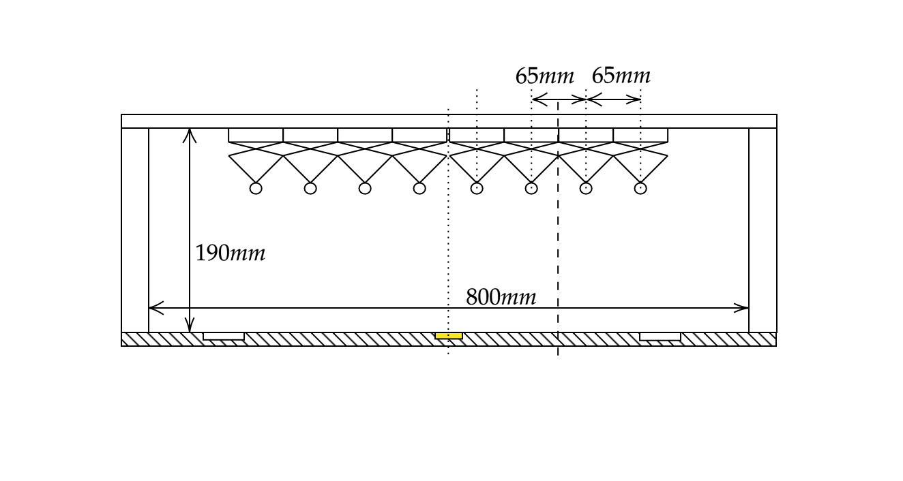

# Charging module

## Material for one charging module

In this list, $X$ will denote the number of charging rail tiles in a charging module. \emph{Reminder}: One charging rail tile can fit $3$ Duckiebots ($1.5$ per lane).

* $8 \times$ $Ø4mm$ diameter brass rod, length $10cm + X \times 59cm$
* $(X + 1)$ $\times$ wooden structure top pieces TODO
* $(2 \times (X + 1))$ $\times$ wooden structure side pieces TODO
* TODO screws
* TODO wires
* $\lceil {\frac {X}{4}}\rceil \times $ power supply which enables you to drive 5V and 30Amps
* $2 \times (X + 1)$ $\times$ insulator - [self-print here](https://www.thingiverse.com/thing:2996297/files) or [order here](https://www.shapeways.com/product/QN3HP9EAH/megacity-insulator)
* TODO

## Building a charging module

### Assemble the wooden structure

Assemble the wooden structure as in (). This part may differ from our reference part. The important and neccessary specifications are: (i) the structure must be larger than one tile such that a road (with margins on both sides) may fit underneath and (ii) the space between the tile and the bottom part of the crossbar must be exactly 19cm.

<figcaption>
An assembled wodden structure.
</figcaption>

### Prepare for mounting the insulators

Make sure you have the parts ready seen in ().

<figcaption>
Parts needed to prepare and assemble a high voltage pole.
</figcaption>

### Drill the holes

Drill 3mm holes such that the insulators will be centered after mounting, seen in ()

<figcaption>
2D sketch of a high voltage pole.
</figcaption>

The 6mm holes (depth roughly 5mm) are optional and act as a hideout for the screw heads. The resulting holes should look like ().

<figcaption>
Drilled holes.
</figcaption>

### Mount the insulator

Mount the insulator 3D prints as seen in () and ().

<figcaption>
The assembled insulator.
</figcaption>

<figcaption>
How the screw head is hidden.
</figcaption>

### Solder things...

TODO

### Attach to power source

TODO
